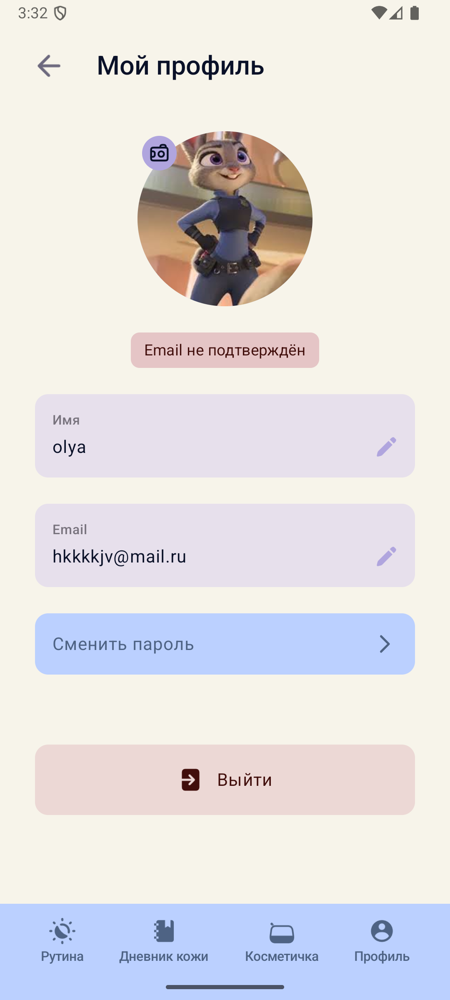
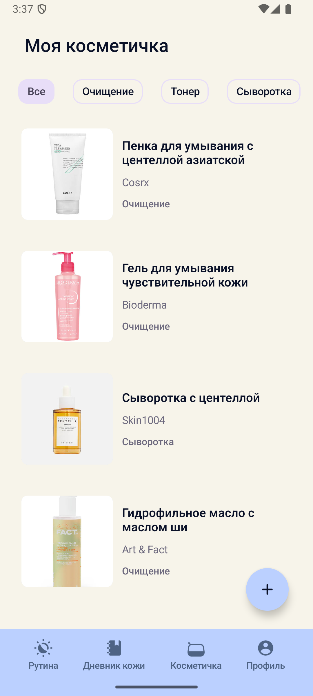
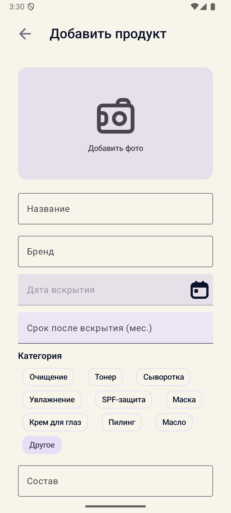
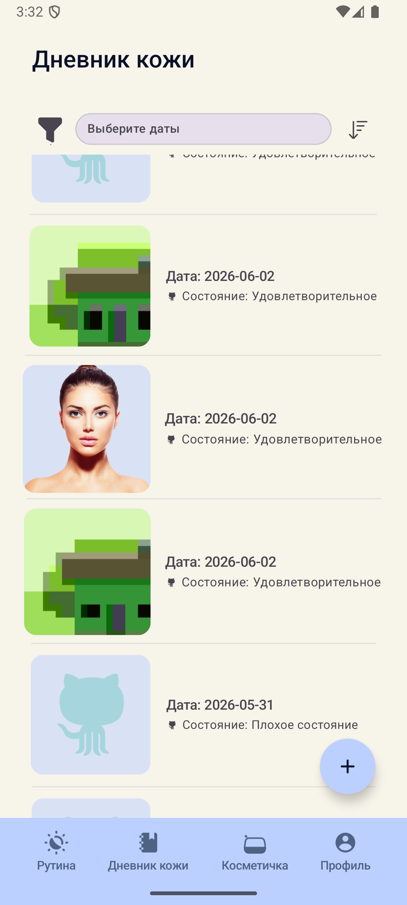
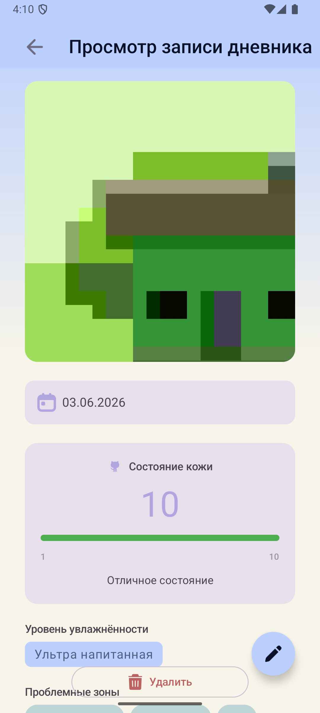
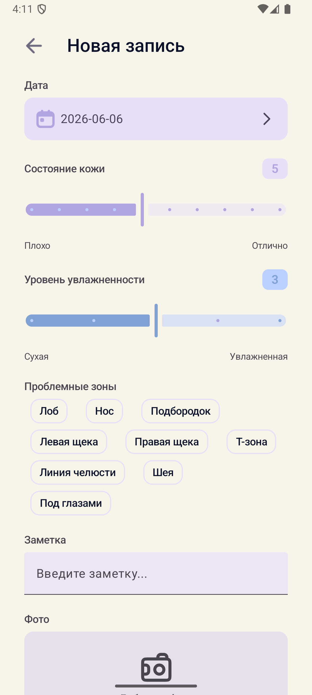

# 🌸 Bloom — Skincare Diary

**Состав команды:** Дергунова Ирина, Перовская Ольга  
**Платформы:** Android (Min SDK 28) + Desktop (JVM)

---

## 📖 Содержание
- [О проекте](#о-проекте)
- [Ключевые возможности](#ключевые-возможности)
- [Архитектура и стек](#архитектура-и-стек)
- [Многомодульность](#многомодульность)
- [Дизайн-система](#дизайн-система)
- [Сеть и офлайн-режим](#сеть-и-офлайн-режим)
- [Аналитика](#аналитика)
- [Запуск и сборка](#запуск-и-сборка)
- [Соответствие требованиям](#соответствие-требованиям)

---

## 📱 О проекте
Bloom — кроссплатформенное приложение для ведения дневника ухода за кожей и управления косметичкой. Помогает отслеживать состояние кожи, учитывать используемые средства и анализировать эффективность ухода. Построено на Kotlin Multiplatform и Compose Multiplatform с единой кодовой базой для Android и Desktop.

## ✨ Ключевые возможности
- 🔐 **Авторизация:** Регистрация с верификацией email, вход, восстановление пароля. Безопасная работа с JWT (access + refresh).
- 👤 **Профиль:** Просмотр и редактирование данных, смена пароля, загрузка аватара.
- 📔 **Дневник кожи:** Создание записей с фото, оценкой состояния (1-10), уровнем увлажненности и проблемными зонами. Фильтрация по датам и сортировка.
- 💄 **Косметичка:** Каталог продуктов с фото, категориями, составом (INCI) и личным рейтингом. Отслеживание срока годности (PAO) и архивирование.
- 🔄 **Офлайн-синхронизация:** Создание записей без интернета с автоматической синхронизацией при появлении сети.

## 🛠 Архитектура и стек
Приложение построено по принципам **Clean Architecture** и **MVI** (Intent → State → Effect). ViewModel вынесены в shared-модуль. Навигация реализована на **Navigation 3**.

| Категория | Технология | Версия |
| :--- | :--- | :--- |
| **Язык и UI** | Kotlin, Compose Multiplatform, Material3 | 2.3.20, 1.11.0, 1.10.0-alpha05 |
| **Навигация** | Navigation 3 | 1.1.1 |
| **Сеть** | Ktor Client | 3.5.0 |
| **Локальная БД** | SQLDelight | 2.3.2 |
| **DI** | Koin | 4.2.1 |
| **Асинхронность** | Coroutines, Serialization, Datetime | 1.11.0, 1.11.0, 0.8.0 |
| **Изображения** | Coil 3 | 3.4.0 |
| **Хранилище** | Multiplatform Settings | 1.3.0 |
| **Аналитика** | Firebase BOM, Crashlytics | 34.14.0, 3.0.7 |

## 🧩 Многомодульность
Проект строго разделен на модули для изоляции фич и ускорения компиляции:
- **`core`**: Базовая инфраструктура (`data`, `domain`, `ui`, `navigation`).
- **`feature`**: Бизнес-фичи (`auth`, `profile`, `skin-diary`, `makeup-bag`).
- **Паттерн `api/impl`**: Каждая фича разделена на `api` (контракты, DTO, роуты) и `impl` (реализация, UI, ViewModel). Это предотвращает циклические зависимости и позволяет модулям не знать о внутренней реализации друг друга.

## 🎨 Дизайн-система
- **Темы:** Полная поддержка Light и Dark режимов на базе Material 3.
- **Стилизация:** Кастомная лавандово-мятная палитра (`ColorsCustom`), унифицированная типографика (`StylesCustom`) и система отступов/радиусов (`DimensionsCustom`).
- **Компоненты:** Библиотека переиспользуемых UI-элементов (`TopBarCustom`, `BottomBarCustom`, `DiaryCard`, `ProductCard`, `StarRating`, `CategoryChip` и др.).
- **Ресурсы:** Используются нативные CMP Resources (`compose.components.resources`).

## 🌐 Сеть и офлайн-режим
- **Ktor Client:** Настроен с кастомным `AuthPlugin` для автоматического добавления Bearer-токена и `TokenRefresher` для бесшовного обновления access-токена при истечении (401).
- **SQLDelight:** Используется для локального кэширования и офлайн-работы. Записи дневника сохраняются локально со статусом `pending` и автоматически отправляются на сервер (`synced`) при восстановлении связи.

## 📊 Аналитика
- **Firebase Analytics:** Автоматическое логирование открытия каждого экрана через `AnalyticsHelper` и `ScreenName`.
- **Firebase Crashlytics:** Перехват и отправка крашей и non-fatal исключений для мониторинга стабильности.

## 🚀 Запуск и сборка

> ⚠️ **Важно:** Для работы аналитики и краш-репортов на Android необходимо добавить файл `google-services.json` в папку `composeApp/`.

**Android:**
```shell
# macOS/Linux
./gradlew :composeApp:assembleDebug

# Windows
.\gradlew.bat :composeApp:assembleDebug
```

**Desktop (JVM):**
```shell
# macOS/Linux
./gradlew :composeApp:run

# Windows
.\gradlew.bat :composeApp:run
```

---

## 📸 Скриншоты

<div align="center">
  
  
  
  
  
  
  
</div>

---
---

Learn more about [Kotlin Multiplatform](https://www.jetbrains.com/help/kotlin-multiplatform-dev/get-started.html)…